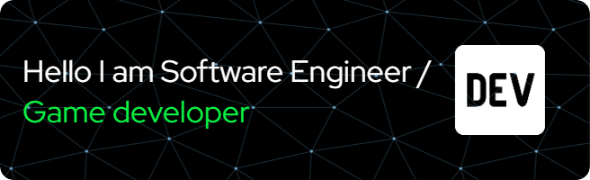

**Hi there I'm Hassan Nasrallah Matouq👋**
================

  

---
Hi, I'm Hassan, a 23-year-old software engineering student with a passion for game development. I've gained hands-on experience with C# and GDScripting, and I'm excited to apply my skills to create engaging gaming experiences. What drives me is the opportunity to combine art, storytelling, and technology to craft immersive worlds. As a student, I'm eager to learn from experienced professionals and take on new challenges. I'm looking for an internship at a game start-up where I can grow as a developer and contribute to innovative projects. Let's connect and get to know each other.

**About Me**
------------

## What I'm currently working on:
I'm developing a 2D Survival Horror Multiplayer Game using Godot Game Engine. My goal is to create a My first Multiplayer Game on Godot engine Engine from Scartch.

* **Education**: Currently studying at  **IPB University** 📚
 

* **Learning**: Currently learning **GDscript**, **Python**, and **C**

**Collaboration**
----------------

* I'm looking to collaborate on game development and internship opportunities in game dev/start-up

**Help Wanted**
--------------

* I'm looking for help with a tech career in writing more efficient code and developing games

**Ask Me About**
----------------

* The game engines I've used and applications I've made throughout my game dev journey

**Get in Touch**
----------------

* [LinkedIn](https://www.linkedin.com/in/hassan-nasrallah-matouq-124a771b0/)
* [Instagram](https://www.instagram.com/foryou_tocode)

**Fun Facts**
--------------

> **I can speak 3 languages: Arabic, English, and Indonesian**
* I have experience with Blender, with an overall experience of 1 month as a game asset designer, and I'm willing to learn more about game dev

- I'm Currently working on my [**Javascript Game Portofolio**](https://code-is-me.github.io/)
